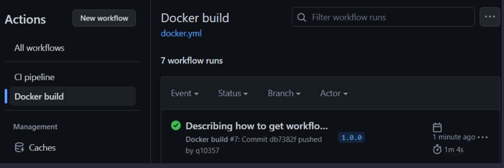

## Del 1 - Prinsipper
### Kontinuerlig integrasjon - hva mener vi med dette, og hvorfor er det viktig?
**Kontinuerlig integrasjon** (CI), er en praksis der man kombinerer prinsipper, verktøy og arbeidsmetoder
for å optimalisere prosessen rundt å merge endringer i kode til et delt repository (intern leveranse).
<br>
&nbsp;<br>
**Tiden før kontinuerlig integrasjon**<br>
For å forstå hvorfor kontinuerlig integrasjon har blitt et "must" for dagens IT orginisasjoner, er det viktig at man forstår hvilke problemer
denne praksisen har som mål å løse.<br>

Tidligere har IT orginisasjoner følgt tradisjonell Vannfall arbeidsmetodikk. <br>
Vannfall arbeitsmetodikk fungerer slik at kode først utvikles i store batches,
deretter testes den, for så å settes i produksjon. Disse stegene skjer sekvensielt,
og det er ikke uvanlig at hver batch inneholder mange måneders arbeid. <br>

Slike store batch størrelser har ofte svært negative koneskvenser.
En av disse konsekvensene er forlenget lead time (LT). Dette er tiden som går fra kode er commited, til den deployes til produksjon.<br>
Ved lang LT, mister man muligheten til å lære fra feil. Det er ingen som lærer noe av
å bli presentert for en kodefeil de skrev for et halvt år siden. Det er også mer sannsynlig at samme feil
gjentas. <br>

Ved større batch størrelser (her de interne leveransene / commits til main), øker også sannsynligheten for merge konflikter. Dette kan føre til en "downward spiral": når merging av kode
blir en smertefull prosess, gjør man det sjeldnere. <br>
Dette fører til at problemene hoper seg opp; hver merge blir mer smertefull enn den forrige.
Man ender opp med å bruke store mengder tid på å løse disse konfliktene. Dette er tid som kunne blitt brukt på å utvikle nye
features, eller andre gunstige aktiviteter.<br>

Når integrasjons prosessen oppleves slik, utvikles ofte ukulturer innen orginisasjonen.
De ansatte frykter å integrere sine kode endringer til main, da ingen ønsker å være den som får systemet til å kræsje.
Denne frykten lager et "blame environment". Arbeid under slike kår
fører til lavere produktivitet, og kan også ha store psykiske belastninger for dem som arbeider med systemet,
om det er innen IT eller et annet felt.<br>

"An organization’s output is directly related to how it communicates internally" <br>
-Conoway's Law<br>

Teorien ovenfor kalles "Conoway's law". Denne teorien går ut på at en orginisasjons output (her IT-systemer), reflekterer deres kommunikasjons struktur. 
En orginisasjon med ukulturer, vil automatisk ha dårligere output. Det å la ver å gjøre endringer i kode i frykt for 
å få skylden for brekk i kode / systemkollaps, er definivtivt en ukultur. Får å forbedre orginisasjonens output må man, ifølge Conoway's lov, 
endre denne tankegangen.<br>
&nbsp;<br>
#### Situasjonen i dag
For å løse problemene ovenfor, har orginisasjoner måttet endre sin tilnærming rundt det å utvikle og vedlikeholde IT-systemer.
Man har migrert fra Vannfall arbeidsmetodikk, til Agile arbeidsmetodikk. Målet er å ha hyppige leveranser, og slik redusere batch størrelser, og ulempene
store batch størrelser fører til. <br>
Det er slik praksisen "Kontinuerlig Integrasjon" ble til. Under nevnes to av nøkkelprinsippene/metodene som skal til for å tilrettelegge
kontinuerlig integrasjon, og hvordan det legger grunnlaget for å løse problemene ovenfor. <br>
&nbsp;<br>
**Trunk based development** - en arbeidsmetode som går ut på å la utviklere jobbe på hver sin branch, og regelmessig (så ofte som mulig) merge koden sin til et delt repository (main).<br>
Når utviklere ønsker å merge koden til main, lages en pull request. Da skal koden bygges, og tester kjøres.
Hvis testene feiler, skal pull requesten avvises.<br>
Slik minsker man batch størrelsen, som igjen minsker sjanser for merge konflikter. <br>
Man kan også sette inn andre mekanismer for å forebygge lav kodekvalitet, for eksempel obligatorisk peer reviews på hver pull request.
&nbsp;<br>
**Automatiserte Tester** - Dette er god praksis i alle prosjekter, men spesielt viktig når man jobber med komplekse systemer. <br>
Selve definisjonen på et komplekst system er at det ikke finnes en enkelt person som forstår systemet fullt ut. Når ingen forstår systemet fullt ut, kan en utvikler gjøre 
endringer i en del av koden, uten å forstå hvordan dette påvirker andre deler av koden. Endringene kan føre til at enkelte deler av koden brekker, og kan i verste fall
føre til system kollaps. Det er derfor svært gunstig å ha automatiserte tester som skjer på hver push/pull request til main, 
som tester at endringene gjort, ikke fører til at systemet kommer i en "undeployable state".
<br>

Kontinuerlig integrasjon har også en positiv virkning på **kulturen** rundt det å gjøre endringer i kode. Når
en utvikler vet at all ny kode/ endringer i gammel kode, kommer til å gå gjennom grundige, automatiserte tester
der eventuelle feil kommer til syne, minskes frykten rundt det å merge kode til main. Utvikleren får også
rask tilbakemelding på kodekvalitet, og kan lære fra eventuelle feil. <br>
Når man ikke frykter å gjøre endringer, samtidig som man kontinuerlig lærer fra tidligere feil, dyrkes 
en aktiv læringskultur. <br>
Dette vil ifølge Conoway's lov føre til bedre systemer.<br>

Kontinuerlig integrasjon tilrettelegger for andre DevOps praksiser, slik som kontinuerlige leveranser.<br>
&nbsp;<br>


### Kontinuerlig leveranser hva mener vi med dette, og hvorfor er det viktig?

Kontinuerlige leveranser er en forlengelse av kontinuerlig integrasjon, hvor hensikten er 
å forenkle/optimalisere leveranse prosessen (deployment process), altså det å sette kode inn i produksjon (ekstern leveranse).<br>
Målet er å gjøre det mulig å deploye kode til produksjon, kun ved et tastetrykk. <br>
For at dette skal være mulig, må kontinuerlig integrasjon være adoptert av orginisasjonen. 
Omfattende, automatisert testing må også være på plass, slik at man minsker risikoen for at noe går galt.
Det er også mulig å automatisere hele leveranse prosessen, altså at kode settes i produksjon uten
noe form for "human intervention". Dette kalles Kontinuerlig Deployment, og er en forlengelse
av kontinuerlig leveranser.
<br>

#### Automatisere deployment-prosessen
Tradisjonelt sett har kode måtte evalueres av en kommite før den settes i produksjon,
noe som ikke er ideelt da det fører til flere overleveringer (handoffs). For hver overlevering blir kunnskap tapt, da de som evaluerer koden 
er "far from the source", og skaper unødvendig byråkrati. Ved å automatisere deployment prosessen fjernes disse hierkiske prosessene, lead time (tiden fra koden commites, til den deployes til produksjon) reduseres ,
og man lar de som er nærmest kjernen, nemlig teamene som daglig utvikler og drifter systemet, følge koden på hvert steg, fra commit, til det settes i produksjon.
Hyppigere leveranser av mindre størrelser gjør også feilsøking enklere. 
<br>
&nbsp;<br>
Så hvordan automatiserer vi deployment-prosessen? Man må først ha en forutsigbar måte å gjøre leveranser på. Kun etter man har dokumentert hvert steg prosessen,
kan den automatiseres. Det er også viktig å sette istand mekanismer som gjør at man kan differansiere mellom deployment og release.<br>
Før kontinuerlig leveranse, brukte man ofte ordene deployment og release om hverandre. Man gjorde seg oftest klar til en  release, hadde all kode samlet, og testet,
og pushet all kodeenringer til produksjon samtidig.
For bedrifter som nå har automatisert sin deployment prosess, og dermed redusert sin deployment lead time, må man differansiere mellom disse begrepene. 
<br>
&nbsp;<br>
Deployment - å ta kompilerte kildekoden inn i et produksjons-miljø.<br>
Release - å aktivere et feature i produksjon.
<br>
&nbsp;<br>
Man kan altså deploye kode som er deler av et feature/funksjon, uten at man ønsker å aktivere funksjonen for brukere. 
For å sørge for at brukere ikke får tilgang til disse fragmenterte funksjonene, kan man bruke feature toggles/flags. 

Når man ønsker å gjøre en funksjon tilgjengelig for brukerne (release), er det flere patterns man kan bruke for å gjøre prosessen så effektiv som mulig. (eksempel: Blue-Green release patterns)
<br>

Så for å oppsummere: <br>
Kontinuerlig leveranse er en forlengelse av kontinuerlig inegrasjon, hvor målet er å optimalisere leveranse prosessen. Dette gjørs ved å
automatisere prosessen. Kontinuerlig leveranse er viktig fordi det fjerner presset man tradisjonelt har følt rundt deployment, dette skaper 
et bedre arbeidsmiljø. Man reduserer også antall overleveringer (handoffs), man lar de som skriver koden følge den helt til produksjon. Reduksjonen 
i overleveringer vil igjen redusere lead time (LT). Hyppige leveranser tilrettelegger også raskere feedback fra brukere.
<br>
&nbsp;<br>

### Forklar hvorfor det er enklere å få innsikt til nøkkelaspektene ved applikasjonen ved å adoptere DevOps, i forhold til Vannfall og et skille mellom drift- og utviklingsteam?

Vannfall arbeitsmetodikk fungerer slik at kode først utvikles i store batches,
deretter testes den, for så å setes i produksjon. Disse stegene skjer sekvensielt,
og det er typisk mange måneders arbeid i hver batch. Utviklere får ingen / svært sen tilbakemelding på sin kode.
Ved agil arbeidsmetodikk kan man la ver å godta kode som ikke inkluderer telemetri, mens dette er mye vanskeligere 
ved Vannfall arbeidsmetodikk. Det er også sannsynlig at en orginisasjon som ikke adopterer DevOps prinsipper, ikke har kulturen
som må til for å motivere sine ansatte til å utvikle gode praksiser rundt utvikling av telemetri.<br>
Med andre ord, når man regelmessig står ovenfor problemer slik som komplekse merge konflikter, kan telemetri bli nedprioritert.

Hvis man ønsker god telemetri er det også problematisk dersom orginisasjonen har et klart skille mellom drift- og utviklingsteam.
Det skapes "information silos". 
En informasjon silo er et begrep som brukes for å beskrive en situasjon der informasjon ikke deles mellom
ulike deler av en orginisasjon. Dette kan føre til ineffektivitet og mangel på koordingering.
-https://www.finanssenteret.as/hva-er-en-informasjonssilo/

Når drift- og utviklingsteam ikke jobber på tvers av hverandre, kan man ende opp med at drift kun skaper telemetri relevant for drift, og utviklere
kun skaper telemetri relevant for utviklere. God telemetri er også med på å skape læringskultur. Alle i organisasjonen får innblikk i hvordan systemet presterer, 
noe som også kan føre til økt eierskap til eget arbeid. Dersom en feil skulle skje, og systemet svikter, 
har man samlet data på business- applikasjon- og hardware nivå, og kan lettere feilsøkes og forebygges.

### Forklar hvordan du kan implementere en løsning basert på tjenester i Amazon Webservices for å få denne oversikten. Hva må du konfigurere i AWS, og hva må du gjøre i applikasjonen?
For å implementere dette kan vi bruke verktøyet terraform. Teraform er et "infrastruktur som kode" verktøy, og kan brukes for å få telemetri om bruk av hardware (eks: CPU), og også
om applikajonen (antall oppskrifter generert etc.)

#### AWS
Du bør ikke bruke din root user, men heller lage en IAM bruker, med nødvendige rettigheter. 
Deretter genererer du en access key, dette er nødvendig for at vi senere skal kunne autentisere oss mot AWS. Da får du to verdier, en
access key id, og en secret access key. Du må ta vare på secret access key, for denne verdien får du kun presentert en gang. <br>
Du legger disse verdiene inn som secrets på ditt GitHub repository. Dette er for å gjøre automatisering av terraform koden mulig.<br>
AWS_ACCESS_KEY_ID=access key id<br>
AWS_SECRET_ACCESS_KEY=secret access key<br>
AWS_REGION: regionen du bruker<br>
&nbsp;<br>
Du kan sette environment secret for ditt repository via GitHubs web interface slik: <br>
settings &rarr; Secrets and Variables &rarr; Actions &rarr; New repository secret <br>
&nbsp;

#### Applikasjon
Du oppretter først et nytt directory, du kan velge navn selv, her går vi for "infra". Deretter en providers.tf fil, hvor du definerer hvem som er provider (her AWS).
Dette kommer til å se noenlunde slik ut: <br>
```hcl
terraform {
  required_providers {
    aws = {
      source  = "hashicorp/aws"
      version = "4.40.0"
    }
  }
}
```
Lag deretter en ny fil, variables.tf. ( Det er ikke nødvendig å skrive terraform kode i ulike filer, da all terraform kode prosesseres som en enkelt fil, men vi gjør det for ryddighetens skyld ).
Her kan du legge inn variabel navn, som emailer og andre verdier som gjentas regelmessig i koden. Slik trenger man kun å gjøre endringer en plass dersom man ønsker å f eks endre email.
Disse defineres når du kjører terraform plan/ apply. <br>
```hcl
variable "bucket_name" {
   type = string
}

variable "candidate_email"  {
   type = string
}
```
Vi kan bruke S3 buckets for å lagre metricsdata.<br>
```hcl
resource aws_s3_bucket "analyticsbucket" {
   bucket = "analytics-${var.bucket_name}"
}
```
Ovenfor definerer vi en s3 bucket, denne brukes for å lagre våre metrics.<br>
```hcl
backend "s3" {
   bucket = "${var.bucket_name}-terraform-state"
   key = "${var.bucket_name}/${var.bucket_name}-terraform.state"
   region = "us-east-1"
}
```
Koden ovenfor må til for å forhindre at terraform prøver å opprette en ny s3 bucket dersom en allerede eksisterer.<br>
&nbsp;<br>
Vi ønsker å få innsyn til for eksempel antall recipies generert. For dette kan vi bruke AWS cloudwatch. Vi oppretter et dashboard, og tilhørende widgets (det vi ønsker å overvåke):<br>
```hcl
resource "aws_cloudwatch_dashboard" "main" {
   dashboard_name = var.candidate_id
   dashboard_body = <<YOURCHOSENNAME
{
  "widgets": [
    {
      "type": "metric",
      "x": 0,
      "y": 0,
      "width": 12,
      "height": 6,
      "properties": {
        "metrics": [
          [
            "${var.candidate_id}",
            "recipies_generated.value"
          ]
        ],
        "period": 300,
        "stat": "Maximum",
        "region": "us-east-1",
        "title": "Total number of recipies generated"
      }
    }
  ]
}
YOURCHOSENNAME
}
```
&nbsp;<br>
For å autumatisere denne prosessen, lager du en ny workflow. Denne kan for eksempel kjøre på hver push/ pull_request.
Her setter du env variabler, for å autentisere seg mot AWS brukes AWS_ACCESSS_KEY_ID, AWS_SECRET_ACCESS_KEY som du tidligere satt som GitHub secrets, og terraform variabler. 
Du definerer stegene for workflowen, terraform init, terraform plan, og terraform apply. <br>
Slik kunne en sånn fil sett ut:<br>
```yaml
name: "Terraform CloudWatch"
defaults:
   run:
      working-directory: infra
on:
   pull_request:
   workflow_dispatch:

jobs:
   terraform:
      name: "Terraform"
      runs-on: ubuntu-latest
      env:
         AWS_ACCESS_KEY_ID: ${{ secrets.AWS_ACCESS_KEY_ID }}
         AWS_SECRET_ACCESS_KEY: ${{ secrets.AWS_SECRET_ACCESS_KEY }}
         AWS_REGION: us-east-1
         BUCKET_NAME: mybucket
         CANDIDATE_EMAIL: my@email.com
      steps:
         - uses: actions/checkout@v3
         - name: Setup Terraform
           uses: hashicorp/setup-terraform@v2

         - name: Terraform Init
           id: init
           run: terraform init

         - name: Terraform Plan
           id: plan
           run: terraform plan  -var="bucket_name=$BUCKET_NAME" -var="candidate_email=CANDIDATE_EMAIL" -no-color
           continue-on-error: false

         - name: Terraform Apply
           run: terraform apply -var="bucket_name=$BUCKET_NAME" -var="candidate_email=$CANDIDATE_EMAIL"  -auto-approve
```
&nbsp;<br>

#### CloudWatch
Videre må du legge til nødvendige dependencies for å få CloudWatch til å fungere i pom.xml fil. Deretter må du konfigurere CloudWatch. 
I dette emnet har dette blitt gjort i en fil kalt MetricsConfig. Her definerer du en bean "CloudWatchAsyncClient", setter nødvendige properties, og konfigurerer etter ønske.
Controllere som leverer metrics, skal implementere interface ApplicationListener<ApplicationReadyEvent>. <br>
For å implementere overvåking av antall oppskrifter generert, kan vi lage en metric av typen Gauge, som rapporterer antall oppskrifter vi har generert.

```java
    @Override
    public void onApplicationEvent(ApplicationReadyEvent applicationReadyEvent) {
        Gauge.builder("recipies_generated_count", recipies,
                r -> r.values().size()).register(meterRegistry);
    }
```
&nbsp;<br>

## Del 2 - GitHub Actions
### Oppgave 1 - GitHub actions workflow

Lag en github actions workflow som gjør følgende for hver pull request som lages i ditt repository:
- [x] Kompilerer koden
- [x] Kjører enhetstester

Under utvikling har jeg jobbet på branchen 'dev', kontinuerlig laget pull requester, og merget dev's commiter til main.
<br>
Jeg laget en test (som ikke tester noe som helst), for å teste at ci.yml fungerer som tiltenkt.<br>
Workflow ci.yml (CI pipeline) kjører på hver pull_request.<br>
&nbsp;<br>

### Oppgave 2 
Dersom man ønsker å sette beskyttelses mekanismer for main branchen slik at det ikke er mulig å merge en Pull Request inn i main branch uten at koden kompilerer 
og enhetstester er kjørt uten feil:<br>
Når du er inne på ditt repository, på GitHubs web interface trykk
<br>
- [ ] Settings &rarr; Branches &rarr; Add branch protection rule <br>
- [ ] På "Branch name pattern", skriver du navne på branchen du ønsker å beskytte, i dette tilfelle skal du skrive "main".
- [ ] huk av "Require a pull request before merging"
- [ ] etter du har gjort steget ovenfør bør en undermeny poppe opp, her huker du av "Require approvals",
under ser du teksten "Required number of approvals before merging: 1". Dette er korrekt, da teksten sier vi skal 
ha godkjennelse fra minst en person.<br>
- [ ] huk deretter av "Require status checks to pass before merging". Da vil koden måtte kompileres og enhetstester kjøre uten feil (ci.yml).<br>
- [ ] scroll ned, og trykk "Create"


## Del 3 Docker
### Oppgave 1
- [x] Skriv en multi stage Dockerfile for java-applikasjonen, slik at kompileringen og byggingen kjører i selvstendige Docker containere. 


### Oppgave 2 - Docker hub
For at workflow skal fungere må man først sette environment secrets: <br>
DOCKER_HUB_USERNAME - ditt dockerhub brukernavn <br>
DOCKER_HUB_TOKEN - passordet til din dockerhub konto <br>
&nbsp;<br>
Dette gjøres ved å gå inn på <br>
github &rarr; settings &rarr; Secrets and Variables &rarr; Actions &rarr; New repository secret <br>
&nbsp;

#### Sensor kan få workflowen til å fungere enten via 
1. **Command Line:** (Du må først laste ned github repoet og ha det på egen maskin). <br>
   &nbsp;Deretter kjører du kommandoene

```sh
git tag 1.0.0
git push --tags
```
&nbsp;<br>
Du kans selvfølgelig bruke den tagen du ønsker (det trenger ikke være 1.0.0)<br>

2. **GitHub web interface:** <br>
Gå inn på ditt repository &rarr; tags<br>
&nbsp;<br>
   &nbsp;
&nbsp;<br>
   &nbsp;&rarr; create new release <br>
&nbsp;<br>
   &nbsp;
&nbsp; <br>
   &nbsp;Skriv inn navn på tag (her 1.0.0).
Scroll ned og trykk "Publish release".<br>
&nbsp;

Da vil workflow "**Docker Build**" automatisk kjøre, du kan se dette ved å trykke på "actions". <br>
&nbsp;<br>
<br>
&nbsp;<br>
&nbsp;<br>
Et nytt container image skal da pushes til din DockerHub konto. <br>
Hvis du nå logger deg inn på DockerHub med samme brukernavn og passord du tidligere definerte i dine "environment secrets"
kan du se ditt container image: <br>
&nbsp;<br>

&nbsp;<br>
&nbsp;<br>

### Oppgave 3

Etter container image er pushet til din DockerHub konto, puller du det til ditt lokale miljøet med kommandoen:

```sh
docker pull <docker_username>/<name_container_image>:<tagname>
```

Du kan da se container image via eks. Docker Desktop. <br>
For å starte ditt container image lokalt kjører du kommando:

```sh
docker run -p 9999:8080  <docker_username>/<name_container_image>:<tagname>
```
&nbsp;<br>
For å teste at alt fungerer som tiltenkt, gå inn på din browser, og lim inn<br>
http://localhost:9999/cake-ingredients?numberOfIngredients=23
<br>I søkefeltet. Du burde da se noe lignende dette: <br> 
&nbsp;


------------------------------

# Eksamenstekst

------------------------------

# Konteeksamen  - PGR301

# Scenario

Du har fått en idé du selv mener er veldig god - et API som lager tilfeldige kakeoppskrifter basert på en rekke ingredienser. Etter en liten helg med koding har du det som ligger i dette repositoryet. Fordi du er helt sikker på at dette kommer til å slå an på et globalt nivå, tenker du det er best å starte med god DevOps praksis fra starten av.

## Krav til leveransen

* Eksamensoppgaven er gitt på GitHub repository ; https://github.com/pgr301-2022/konte-2022
* Du skal ikke lage en fork av dette repositoryet, men kopiere innholdet til et nytt. Årsaken er at sensor vil lage en fork av ditt repo, og arbeidsflyten blir lettere hvis ditt repo ikke er en fork.
* Du kan jobbe i et public-, eller privat repo, og deretter gjøre det public noen timer etter innleveringsfrist hvis du er bekymret for plagiat fra medstudenter.

Når sensor evaluerer oppgaven vil han/hun se på

* Ditt repository og "Actions" fanen i GutHub for å bekrefte at Workflows faktisk virker
* Vurdere drøftelsesoppgavene. Du må lage en  "Readme" for besvarelsen i ditt repo.
* Sensor vil Lage en fork av ditt repo og tester ut pipelines med egen Docker hub/github bruker.

## Evaluering

* Del 1 Prinsipper - 30 poeng
* Del 2 GitHub actions - 30 poeng
* Del 3 Docker - 40 poeng

# Om applikasjonen 

Du kan start applikasjonen lokalt ved å kjøre

```shell
mvn spring-boot:run
```

Og deretter åpne en nettleser med for eksempel - http://localhost:8080/cake-ingredients?numberOfIngredients=23

## Del 1 - Prinsipper

Forklar hvordan et større utviklingsteam kan samarbeide om videreutvikling av denne applikasjonen 
med tanke på:

* Kontinuerlig integrasjon - hva mener vi med dette, og hvorfor er dette viktig?
* Kontinuerlige leveranser - hva mener vi med dette og hvorfor er det viktig?

Når applikasjonen er i drift, ønsker du å ha god innsikt i både forretningsmessige og tekniske aspekter ved 
applikasjonen. Eksempler; antall brukere, antall oppskrifter generert - men også respontider, feilrater, CPU og minnebrukt osv   

* Forklar hvorfor det er enklere å få denne innsikten når man adopterer DevOps, i forhold til Vannfall og et skille mellom drift- og utviklingsteam.
* Forklar hvordand du kan implementere en løsning basert på tjenester i Amazon Webservices for å få denne oversikten. Hva må du konfigurere i AWS, og hva må du gjøre i applikasjonen?

## Del 2 - GitHub actions 

### Oppgave 1 - GitHub actions workflow

Lag en GitHub actions workflow som gjør følgende for hver pull request som lages i ditt repository:

* Kompilerer koden
* Kjører enhetstester

### Oppgave 2

Beskriv med ord eller skjermbilder hvordan man kan konfigurere GitHub på en slik måte at 

* Det ikke er mulig å merge en Pull Request inn i main branch, uten at koden kompilerer og enhetstester er kjørt uten feil.
* Minst en annen person i teamet har godkjent endringen 

## Del 3 Docker 

I denne oppgaven trenger du en konto på Docker Hub https://hub.docker.com/

### Oppgave 1 

Skriv en multi stage ```Dockerfile``` for Java-applikasjonen, slik at kompileringen og byggingen kjører i selvstendige Docker containere.

### Oppgave 2 - Docker hub

Lag en GitHub actions workflow som bygger et container image og pusher det til din Docker 
hub konto hver gang noen pusher en tag til repositoryet. 

For eksempel skal kommandoene under, når det gjøres mot ditt GitHub Repository resultere i et nytt container image med tag 1.0.0 i Docker Hub

```sh
git tag 1.0.0
git push --tags
```

Beskriv hva sensor må gjøre for å få workflowen til å fungere i sin egen GitHub-konto.

### Oppgave 3 

Test din egen workflow, slik at du får minst ett container image i din Docker Hub konto.
* Hvilken docker kommando kan sensor bruke for å laste ned og starte ditt container image fra docker hub? Applikasjonen skal være tilgjengelig på http://localhost:9999 etter oppstart 

Fullfør ```docker ..```
